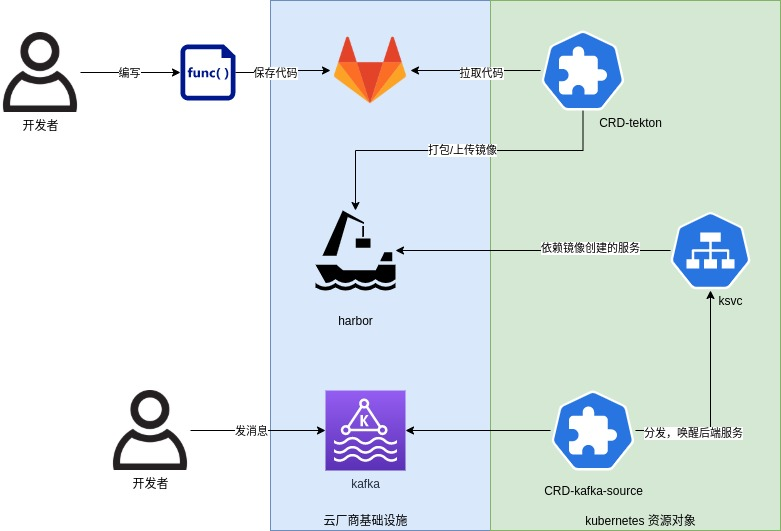

1. 函数计算流程


2. yaml目录下有测试用的资源定位文件
```
yaml/
├── fc
│   ├── 01_kafka_source.yaml　-->kafka source 定义消息队列相关信息和转发信息
│   └── 02_ksvc.yaml　-->ksvc定义
└── tekton
    ├── 01_harbor_auth.yaml　　-->harbor认证信息
    ├── 02_task_build_push.yaml　　-->tekton task定义
    ├── 03_pipeline_resource.yaml　　-->tekton pipeline resource定义
    └── 04_taskrun_build_push.yaml　　-->tekton taskrun定义
```